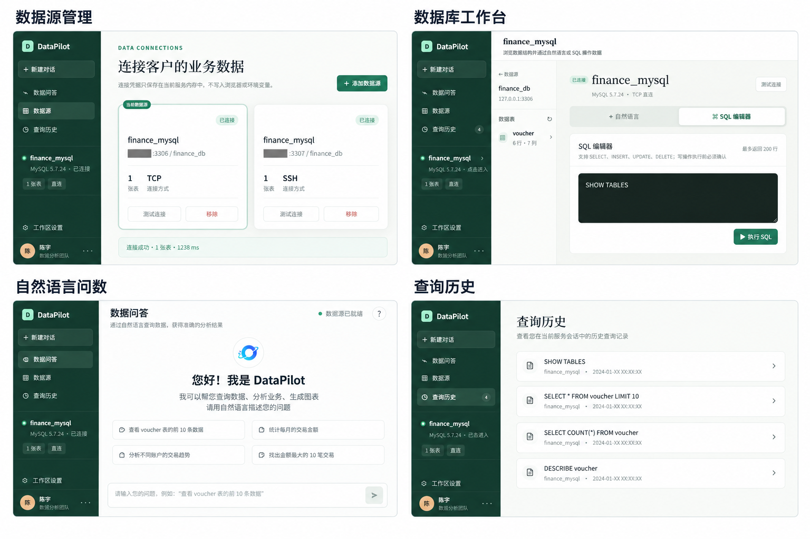

<div align="center">

**简体中文** | [English](README_EN.md)

# DataPilot：面向 ERP 财务场景的智能问数系统

**连接企业数据库，用自然语言完成安全、可追溯的财务数据分析。**

[](https://nodejs.org/)
[](https://react.dev/)
[](https://www.mysql.com/)
[](https://www.deepseek.com/)
[](#什么是-datapilot)

[项目介绍](#什么是-datapilot) · [功能展示](#功能展示) · [快速开始](#快速开始) · [系统架构](#系统架构) · [安全设计](#安全与权限)

</div>


> DataPilot 是一个面向 ERP 财务分析的本地优先 Data Agent。它将身份与租户校验、业务语义理解、Schema/指标检索、SQL 生成、安全校验、数据库执行和结果分析组织为一条可扩展的 Agent 链路。

## 什么是 DataPilot？

传统 BI 要先建报表，数据库客户端又要求使用者熟悉表结构和 SQL。DataPilot 位于两者之间：业务人员可以直接询问“本月收入和支出分别是多少”，技术人员也可以进入数据库工作台检查 Schema 或执行经过权限控制的 SQL。

当前版本聚焦 ERP 财务场景，已覆盖：

- 收入、费用、应收、应付、利润等常用指标语义；
- 同比、环比、趋势、Top N 与多表关联查询；
- MySQL 直连及 SSH 私钥隧道；
- 持久化多会话、多轮自然语言问数、结果表格、简单图表和 SQL 展示；
- 数据源管理、数据库工作台和本地查询历史；
- 多租户、账套隔离以及数据库、表、字段、数据范围权限；
- Agent Loop、Tool Registry、Session/Context 和可替换模型适配器。

## 为什么选择 DataPilot？

### 面向财务业务，而不只是生成 SQL

内置收入、费用、应收、应付、利润、同比和环比等指标语义。模型同时参考真实 Schema、指标定义和最近会话，减少脱离业务口径的查询。

### 默认只读，模型不能直接接触数据库

自然语言问数只允许 `SELECT` / `WITH ... SELECT`。模型只能调用注册后的数据库 Tool，数据库凭据不会进入 Prompt。

### 租户与账套双重隔离

每个数据源归属于指定租户和账套。连接列表、Schema、SQL 工作台和问数接口都会在服务端校验归属，而不是依赖前端隐藏。

### 可扩展 Agent Harness

模型、工具、权限、会话、ERP 规则与数据库驱动相互解耦。后续可以替换模型、加入新的数据库 Tool，或接入隔离的 Python/文件分析 Sandbox。

## 功能展示



### 1. 数据源管理

客户在前端自行填写数据库地址、端口、库名、用户名和密码，也可以启用 SSH 私钥隧道。连接信息由本地服务使用 AES-256-GCM 加密持久化，不写入浏览器。

### 2. 数据库工作台

点击具体数据源即可进入工作台，浏览业务表与字段，并使用自然语言或 SQL 操作数据。管理员的写操作需要二次确认；分析师和查看者保持只读。

### 3. ERP 自然语言问数

业务人员无需了解表结构。Data Agent 会检索相关指标和 Schema，生成 SQL，通过安全策略后执行，并将真实数据整理为结论、明细和图表。

### 4. 分析会话与查询历史

“最近分析”由服务端持久化完整的多轮消息与结果，并按租户、账套和用户隔离；“查询历史”仍是浏览器本地保存的单次 SQL 执行记录，用于搜索、查看和重新运行，不与会话上下文混用。

## Agent 工作流


一次问数最多进行三轮 SQL 修正。每个步骤都会记录执行状态和耗时，便于排查模型生成、权限策略或数据库执行问题。

## 系统架构

```text
app/                         React / vinext 用户界面
server/
├── agent/                   Agent Loop 与 Harness
├── auth/                    身份、角色及细粒度权限
├── context/                 Session / Context 接口
├── domain/erp/              财务指标和 ERP Text2SQL 规则
├── llm/                     可替换的模型适配器
├── security/                SQL 解析与安全策略
├── tools/                   Tool Registry 和数据库工具
├── sandbox/                 Python / 文件分析预留接口
├── connection-store.ts      加密的数据源持久化
├── database.ts              MySQL / SSH 数据库访问层
└── index.ts                 HTTP API 与依赖装配
```

更详细的设计说明见 [docs/architecture.md](docs/architecture.md)。

## 快速开始

### 环境要求

- Node.js `>= 22.13.0`，推荐 Node.js 22 LTS；
- npm；
- 可访问的 MySQL 5.7 / 8.x 数据库；
- DeepSeek API Key。

### 1. 克隆与安装

```bash
git clone https://github.com/qingxue0126/datapilot.git
cd datapilot
npm install
```

### 2. 配置模型

复制示例配置：

```bash
cp .env.example .env
```

Windows PowerShell：

```powershell
Copy-Item .env.example .env
```

在 `.env` 中至少配置：

```dotenv
DEEPSEEK_API_KEY=your-api-key
DEEPSEEK_BASE_URL=https://api.deepseek.com
DEEPSEEK_MODEL=deepseek-chat

API_PORT=3001
WEB_ORIGIN=http://localhost:3000
NEXT_PUBLIC_API_BASE_URL=http://localhost:3001
QUERY_MAX_ROWS=200
```

数据库主机、账号、密码与 SSH 私钥由用户在 DataPilot 前端填写，不需要写入 `.env`。

### 3. 本地启动

```bash
npm run dev
```

启动后访问：

- Web UI：<http://localhost:3000>
- API：<http://localhost:3001>
- 健康检查：<http://localhost:3001/api/health>

### 4. 添加数据源并问数

1. 打开“数据源”，点击“添加数据源”；
2. 填写客户自己的 MySQL 连接信息，可选 SSH 隧道；
3. 测试并保存连接；
4. 进入“数据问答”，例如询问：

```text
本月收入和支出分别是多少？
按月展示今年的利润趋势。
本季度应收账款同比变化是多少？
列出金额最高的 10 笔凭证。
```

## 安全与权限

| 层级 | 当前实现 |
| --- | --- |
| 身份 | 本地开发使用固定演示身份；生产模式支持 HS256 JWT |
| 租户隔离 | 数据源绑定 `tenantId + accountSetId`，服务端逐请求校验 |
| 角色 | `tenant_admin`、`finance_analyst`、`finance_viewer` |
| 数据库权限 | 管理员可使用独立工作台写操作；其他角色只读 |
| 表权限 | `allowedTables` 白名单 |
| 字段权限 | `deniedColumns` 黑名单，受限时拒绝 `SELECT *` |
| 数据范围 | 按表、字段和允许值校验查询条件 |
| SQL 安全 | AST 解析、单语句限制、危险函数与 DDL/DML 拦截 |
| 凭据存储 | AES-256-GCM 加密，密钥与密文保存在 `.data/` 且不进入 Git |

生产环境建议配置 `AUTH_JWT_SECRET`，并通过 `DATAPILOT_PERMISSION_RULES_JSON` 按租户、账套和角色下发细粒度权限。示例见 [架构文档](docs/architecture.md#隔离和权限)。

## 常用命令

```bash
npm run dev          # 同时启动 Web 与 API
npm run dev:web      # 仅启动前端
npm run dev:api      # 仅启动 API
npm run test:server  # SQL 安全策略等服务端测试
npm run build        # 生产构建检查
npm run lint         # ESLint 检查
```

## 当前范围与路线图

| 能力 | 状态 |
| --- | --- |
| MySQL 直连 / SSH 隧道 | ✅ 已实现 |
| ERP 财务 Text2SQL | ✅ 已实现 |
| Tool Registry / Agent Loop | ✅ 已实现 |
| 多租户、角色及细粒度数据权限 | ✅ 已实现基础框架 |
| 查询结果表格与简单图表 | ✅ 已实现 |
| PostgreSQL / SQL Server / Oracle | 🗓️ 规划中 |
| 持久化多轮分析会话 | ✅ 已实现 |
| 审计中心 | 🗓️ 规划中 |
| Python Sandbox / 文件分析 | 🧩 已预留接口 |
| 指标管理与语义层配置 UI | 🗓️ 规划中 |

## 项目原则

- 默认安全：智能问数始终只读；
- 真实执行：回答必须来自客户数据库的真实查询结果；
- 最小暴露：模型只看到权限范围内的 Schema 和结果；
- 模块解耦：Agent、模型、数据库、权限、Prompt 与业务规则独立演进；
- 本地优先：当前版本默认本地启动，不自动部署线上环境。

## 参考与致谢

DataPilot 的 README 信息组织与 Agentic Data Assistant 表达方式参考了 [DB-GPT](https://github.com/eosphoros-ai/DB-GPT)，具体架构和实现聚焦于 DataPilot 当前的 ERP 财务问数链路。

## 贡献

欢迎通过 [Issues](https://github.com/qingxue0126/datapilot/issues) 提交问题、业务口径建议或功能需求。
