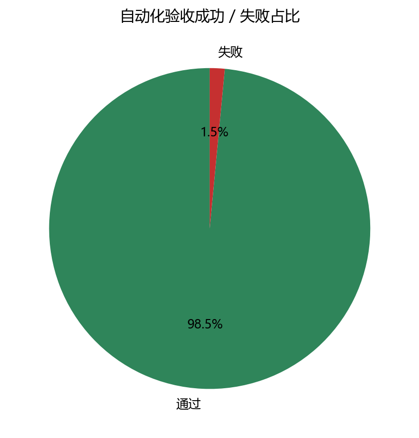
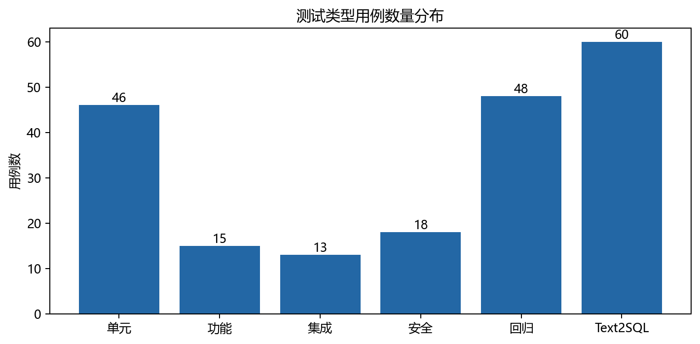
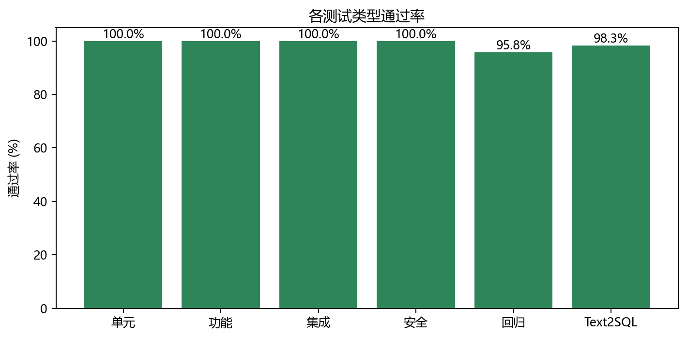
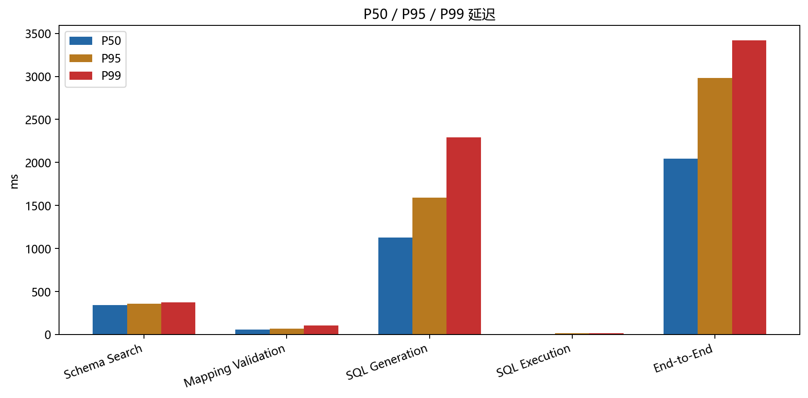
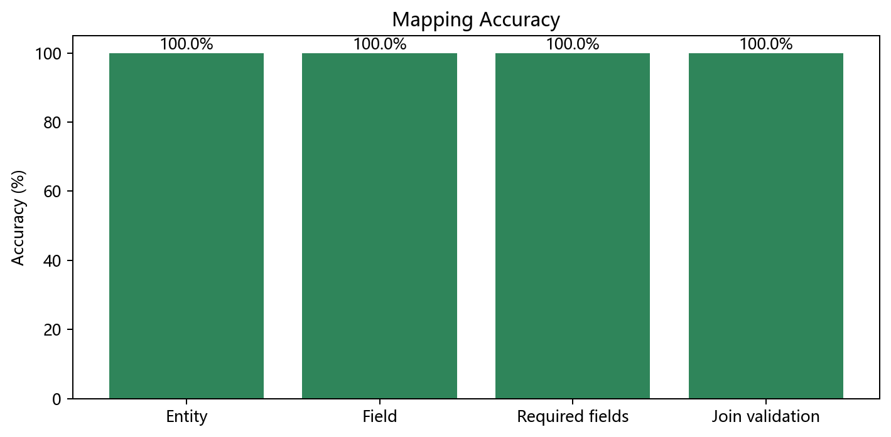
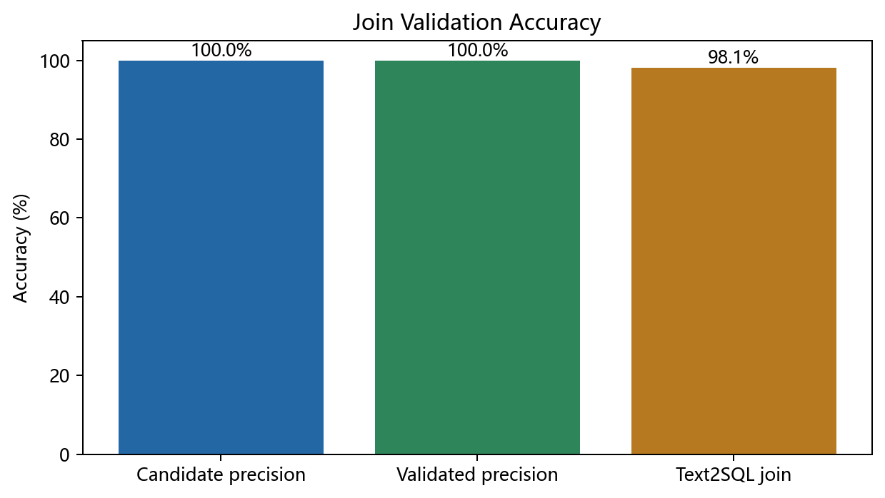
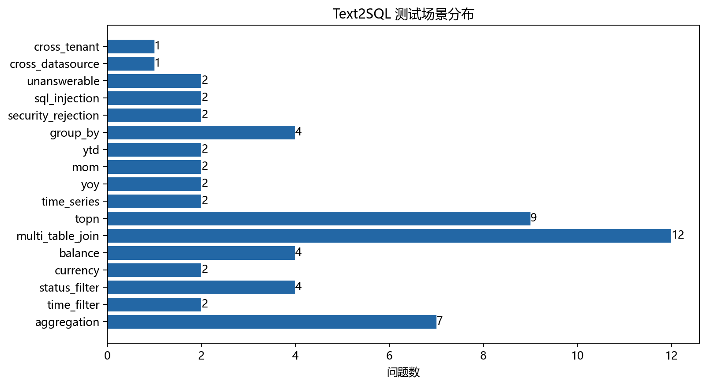
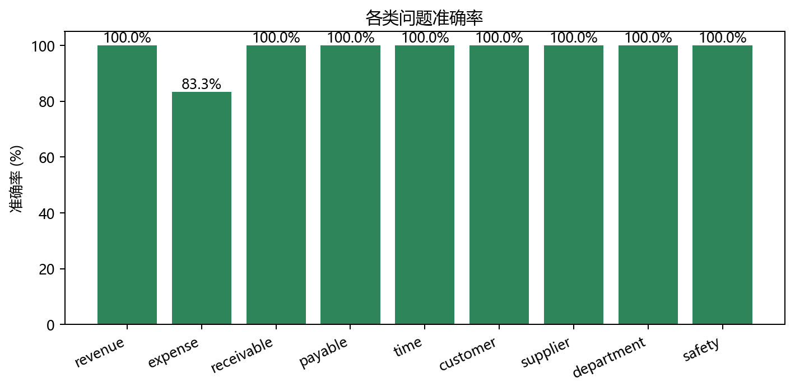
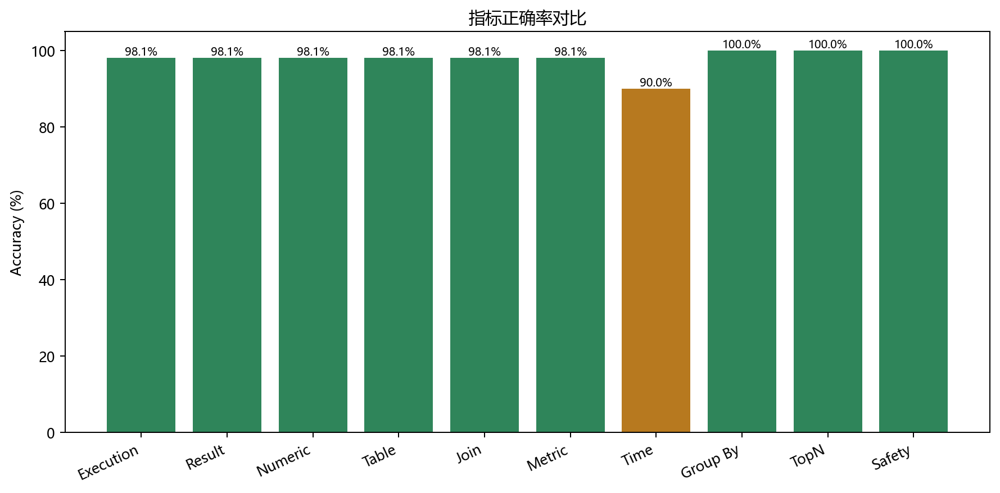
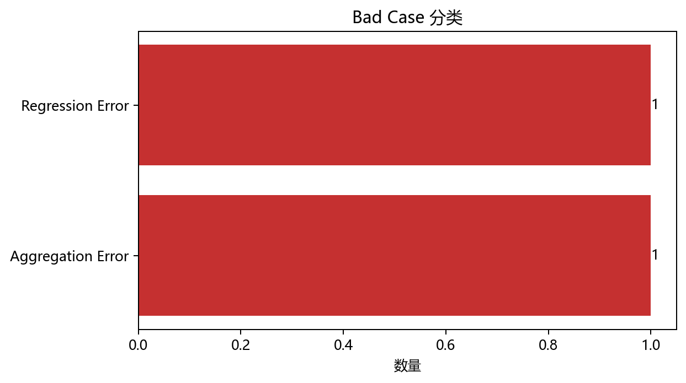

# DataPilot ERP Mock 测试与量化验收报告

生成时间：2026-09-25T13:48:27.930Z

目标数据库：`datapilot_mock`

固定 Seed：`20260925`

## 1. 测试概述

本轮在独立 MySQL 数据库中构造可重复 ERP 财务数据，通过现有 DataSource API 接入 DataPilot，执行单元、功能、集成、安全、回归和基础性能测试。浏览器自动化因已知 trust 问题未使用，UI 验收另见 [manual-ui-checklist.md](manual-ui-checklist.md)。

自动化共计 **200** 个检查，**197** 个通过、**3** 个失败，总通过率 **98.50%**。Text2SQL 标准题集 60 条，通过率 **98.33%**。

## 2. 测试目标与范围

覆盖 Schema Mapping、Mapping Registry、Review/Validation、Join Policy、Join Validation、Finance Metric、Data Agent、Text2SQL、SQL Safety、DataSource/Query API、版本发布/Diff/Rollback、租户/数据源隔离和基础延迟。未执行 100/500 并发压力、浏览器自动点击、真实生产租户认证与生产数据写入。

## 3. 测试环境

- Windows，Node.js v22.23.2
- MySQL 5.7.24，127.0.0.1:3306
- 数据库：datapilot_mock（未访问或修改 finance_db）
- LLM：项目当前 DeepSeek 配置，temperature=0
- API：本地隔离端口 3199

## 4. Mock 数据设计

核心 9 表严格对应当前 ERP 实体；凭证与分录保持借贷平衡，POSTED/VOID/DRAFT/INVALID_STATUS 同时存在；原币 USD 与本位币金额并存；收入、费用、应收、应付按固定金额分摊。15 条异常目录覆盖缺失 accountCode、错误 Mapping、缺失/低质量/不唯一 Join、无效字段、异常状态、多币种、重复 Join、写 SQL、注入及跨范围访问。

## 5. Mock 数据规模

| 表 | 行数 |
| --- | --- |
| organization | 5 |
| department | 20 |
| account | 180 |
| customer | 200 |
| supplier | 150 |
| voucher | 1800 |
| voucher_entry | 7200 |
| receivable | 1500 |
| payable | 1500 |
| erp_anomaly_case | 15 |

## 6. 测试方法

1. 一键重建数据库并用独立 SQL 校验 Golden Answer。
2. 无配置执行 Auto Mapping，再与 74 个字段 Ground Truth 对比。
3. 通过 DataSource API 保存 Draft、Validate、Publish、Diff、Rollback。
4. 60 条问题逐条调用真实 Data Agent，按可执行性、表/字段、Join、指标、时间、聚合和业务结果判定。
5. 安全用例同时覆盖问题入口、生成 SQL、SQL AST 策略、权限与 Registry 隔离。
6. 多轮采样计算 Average/P50/P95/P99/Max。

## 7. 单元测试结果

46 / 46 通过（100%），较本轮开始的 41 条增加 5 条，覆盖数据库专属 Mapping 配置、VoucherEntry 主外键映射、费用短问法、跨库 SQL、OR 条件分组和问题入口安全；无新增单元失败。

## 8. 功能测试结果

| 类型 | 总数 | 通过 | 失败 | 通过率 |
| --- | --- | --- | --- | --- |
| 单元测试 | 46 | 46 | 0 | 100.00% |
| 功能测试 | 15 | 15 | 0 | 100.00% |
| 集成测试 | 13 | 13 | 0 | 100.00% |
| 安全测试 | 18 | 18 | 0 | 100.00% |
| 回归测试 | 48 | 46 | 2 | 95.83% |
| Text2SQL | 60 | 59 | 1 | 98.33% |

15 个功能点全部通过：数据源、Raw Schema、Auto Mapping、Mapping/Join 查看、Draft、Validate、Publish、Published 优先、Versions、Diff、Rollback、问答/SQL/Trace/Explanation、Mapping 不足拒答。

## 9. 集成测试结果

13 / 13 通过。完整链路 MySQL → Raw Schema → ERP Adapter → Semantic Mapping → Registry → Join Validation → Metric → Text2SQL → SQL Safety → Execute → Answer → Trace/Explanation 已验证；单表、聚合、时间、客户、供应商、部门、应收应付、多币种和状态排除均有覆盖。

## 10. 安全测试结果

18 / 18 通过。写操作、DDL、多语句、注释注入、危险函数、敏感字段、越权表、SELECT *、非法字段、错误 Mapping、低命中率 Join、右表不唯一、Cross-Datasource、Cross-Tenant 和越权发布/回滚均正确拦截；安全查询无误拦截。Text2SQL 安全拒答 8 / 8。

## 11. 回归测试结果

46 / 48 通过（95.83%）。本轮 46 条 server 测试全部通过、生产构建成功；现有 `tests/rendered-html.test.mjs` 的 2 条 starter 断言失败：构建 HTML 不含 `codex-preview=development` meta，且 `app/_sites-preview/SkeletonPreview.tsx` 已不存在。相关文件本轮未修改，因此判定为既有测试债务；未发现本轮新增 server 功能退化。

## 12. 性能测试结果

本轮属于单机基础性能测试，不是 100/500 并发用户级压力测试。

| 阶段 | Average ms | P50 | P95 | P99 | Max |
| --- | --- | --- | --- | --- | --- |
| Schema Search | 334.33 | 338.65 | 357.43 | 370.94 | 370.94 |
| Mapping Validation | 60.11 | 57.93 | 68.07 | 105.38 | 105.38 |
| SQL Generation | 1153.24 | 1126 | 1590 | 2292 | 2292 |
| SQL Execution | 5 | 3.46 | 12.68 | 12.87 | 12.87 |
| End-to-End | 2183.87 | 2046.44 | 2981.49 | 3421.05 | 3421.05 |

## 13. Mapping 专项测试结果

| 指标 | 结果 |
| --- | --- |
| Entity Mapping Accuracy | 100.00% |
| Field Mapping Accuracy | 74/74 (100.00%) |
| Required Field Coverage | 29/29 (100.00%) |
| Join Candidate Precision | 100.00% |
| Validated Join Precision | 100.00% |
| Mapping 发布成功率 | 100% |

## 14. Text2SQL 准确率测试

| 指标 | 结果 |
| --- | --- |
| sqlExecutionSuccessRate | 98.08% |
| resultAccuracy | 98.08% |
| exactNumericAccuracy | 98.08% |
| tableAccuracy | 98.08% |
| joinAccuracy | 98.08% |
| metricAccuracy | 98.08% |
| timeFilterAccuracy | 90.00% |
| groupByAccuracy | 100.00% |
| topNAccuracy | 100.00% |
| safetyRejectionAccuracy | 100.00% |
| totalPassRate | 98.33% |

59 / 60 标准问题通过。唯一失败 `EXP-02 本月费用合计` 在三次生成中都产生未分组科目 OR 条件，被新增的业务正确性校验拒绝，未执行错误 SQL；这属于安全失败（fail closed），但仍记为 Text2SQL 未通过。

## 15. Golden Answer 对比结果

| Golden Answer | 值 |
| --- | --- |
| 2025-09 营业收入 | 1,000,000 |
| 2026-08 营业收入 | 1,100,000 |
| 2026-09 营业收入 | 1,200,000 |
| 同比 | 20.00% |
| 环比 | 9.09% |
| 2026 年 1-9 月累计收入 | 8,250,000 |
| 2026-09 期间费用 | 300,000 |
| 销售部 2026-09 费用 | 120,000 |
| 应收余额 | 1,000,000 |
| 客户 A / B 应收 | 300,000 / 200,000 |
| 应付余额 | 700,000 |
| 供应商 A 应付 | 180,000 |

## 16. Bad Case 分析

当前真实失败只有 2 类，不补造到 5 类。

| 编号 | 分类 | 示例 | 根因 | 影响 | 建议 |
| --- | --- | --- | --- | --- | --- |
| EXP-02 | Aggregation Error | 本月费用合计 | SQL 生成错误：多个科目 OR 条件必须整体加括号后再与时间、状态和维度条件组合 | User question does not produce an executable answer | Strengthen validated Join Path prompting and post-generation join checks |
| regression-command | Regression Error | undefined | exit code 1 | Automated test baseline is not green | Inspect the captured command output and repair without weakening assertions |

已在测试中发现并修复的高优先级 Bad Case：VoucherEntry.voucherId 误映射、跨库限定名绕过、费用短问法漏检索、状态枚举猜测、直接应收/应付表未优先、未分组 OR 被错误执行、写/DDL 注入意图未在入口拒绝。

## 17. 典型成功案例

- **REV-01 2026年9月营业收入是多少？**：结果 [{"营业收入":"1200000.00"}]；SQL：`SELECT SUM(ve.credit_amount - ve.debit_amount) AS 营业收入 FROM voucher_entry ve WHERE ve.status = 'POSTED' AND ve.fiscal_year = 2026 AND ve.accounting_period = 9 AND ve.account_code LIKE '6001%' LIMIT 200`
- **REV-02 本月营业收入是多少？**：结果 [{"本月营业收入":"1200000.00"}]；SQL：`SELECT SUM(ve.credit_amount - ve.debit_amount) AS 本月营业收入 FROM voucher_entry ve WHERE ve.account_code LIKE '6001%' AND ve.status = 'POSTED' AND ve.fiscal_year = YEAR(CURDATE()) AND ve.accounting_period = MONTH(CURDATE()) LIMIT 200`
- **REV-03 2026-08 的营收金额**：结果 [{"营业收入金额":"1100000.00"}]；SQL：`SELECT SUM(ve.credit_amount - ve.debit_amount) AS 营业收入金额 FROM voucher_entry ve WHERE ve.status = 'POSTED' AND ve.fiscal_year = 2026 AND ve.accounting_period = 8 AND ve.account_code LIKE '6001%' LIMIT 200`

## 18. 典型失败案例

- **EXP-02 本月费用合计**：SQL 生成错误：多个科目 OR 条件必须整体加括号后再与时间、状态和维度条件组合
- **Rendered HTML regression**：2 条过期 starter 断言失败，生产构建本身成功。

## 19. 当前系统能力边界

- 仅实现 MySQL；本环境实际为 5.7，因此提示层已禁止比较查询使用 CTE。
- 状态、币种、会计期间仍依赖各租户真实样本与发布 Mapping。
- LLM 生成具有小概率格式波动，需保留业务语义后校验与重试。
- 当前 Mapping Registry 为本地文件持久化，不是多节点事务型 Registry。
- 本轮未验证生产 JWT/OIDC、并发容量、灾备、审计导出和真实 ERP 大规模异构 Schema。

## 20. Readiness 判定

- **Demo：达到。** 核心链路、解释、Trace、版本流程与 Golden Answer 可稳定展示。
- **POC：有条件达到。** 需限定在已发布 Mapping、已确认口径、单机低并发环境，并接受 LLM 失败重试。
- **Production Readiness：未达到。** 仍有回归测试债务、单问法失败、文件型 Registry、认证/并发/灾备/审计与真实客户化口径缺口。

## 21. 下一阶段改进建议

1. 将财务科目范围与状态值编译为结构化 SQL 约束或模板，而非完全依赖提示。
2. 修复/移除过期 rendered-html starter 测试，建立稳定 UI smoke suite。
3. 为 Mapping Registry 引入数据库持久化、乐观锁、审计查询和多节点一致性。
4. 扩充到真实 ERP Schema、特殊会计期间、红字、冲销、汇率和期初余额场景。
5. 增加并发、容量、长查询熔断、超时、资源限额和灾备演练。
6. 完成生产 JWT/OIDC、行级权限、跨租户渗透测试和人工 UI 签字验收。

## 修改分类

- **测试基础设施**：Mock schema/seed/generator/reset、60 问题集、六类 runner、报告/图表/PDF 生成器、UI 清单。
- **产品 Bug 修复**：主外键自动映射、数据库专属 Mapping 配置、费用检索、真实状态样本传递、直接余额表优先、OR 分组校验、跨数据库 SQL 阻止、问题入口写/DDL 拒绝、MySQL 5.7 比较查询约束。
- **未修复**：`EXP-02` 三次生成仍不满足 OR 分组；2 条过期 rendered-html 回归断言。

## 原始证据

机器可读结果位于 `reports/results/`；Golden Answer 位于 `scripts/mock-erp/expected-results.json`；所有图表位于 `reports/assets/`。
